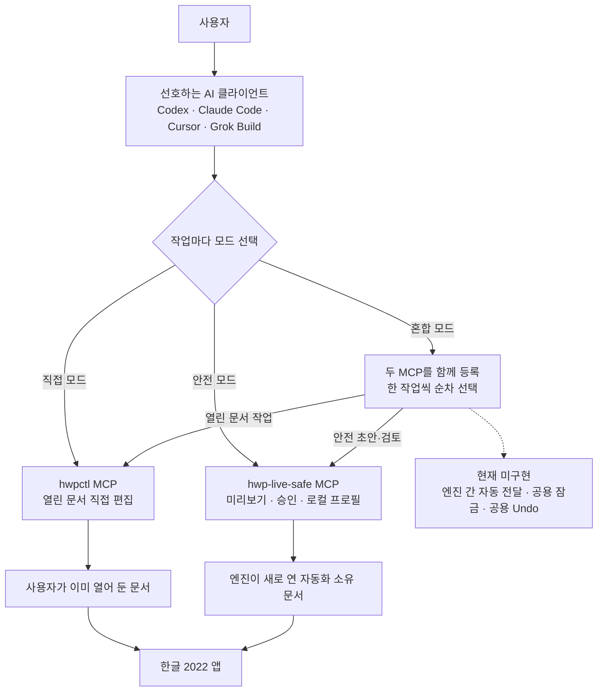

# HWP AI Bridge

[](https://github.com/Jasujung99/hwp-ai-bridge/actions/workflows/public-baseline.yml)

[Discussions](https://github.com/Jasujung99/hwp-ai-bridge/discussions) ·
[Changelog](CHANGELOG.md) · [Security](SECURITY.md)

한글 2022를 AI 코딩 도구와 함께 쓰기 위한 **사용자 선택형 연결 허브**입니다.
한글을 직접 제어하는 엔진을 복제하지 않고, 사용자가 원하는 편집 방식과 AI
클라이언트를 골라 연결할 수 있도록 설명서와 검증된 설정 예제를 제공합니다.

> 이 저장소 자체는 한글 편집 엔진이 아닙니다. 아래 두 엔진 중 하나 이상을 별도로
> 설치해야 하며, 중요한 문서는 반드시 복사본에서 먼저 시험하세요.

## 한눈에 보는 연결 방식



혼합 모드는 현재 별도 라우터가 아니라 **두 MCP 서버를 함께 등록하고 작업마다 하나씩
호출하는 운영 방식**입니다. `hwpctl`과 `hwp-live-safe`는 같은 한글 문서를 공동 편집하지
않으며, 문서 본문이나 변경 이력을 자동으로 주고받지 않습니다. 자세한 경계는
[구조와 책임 분리](docs/architecture.md)와 [작업 모드](docs/modes.md)에 정리되어 있습니다.

## 먼저 선택하세요

| 원하는 방식 | 설치할 엔진 | 적합한 경우 |
| --- | --- | --- |
| 직접 모드 | [`hwpctl`](https://github.com/Jasujung99/hwpctl) | 이미 열어 둔 한글 문서의 짧은 수정, 표 채우기, 서식 변경 |
| 안전 모드 | [`hwp-live-safe`](https://github.com/Jasujung99/hwp-live-safe) | 새 초안, 개인정보 입력, 장문·불확실한 변경의 검토와 승인 |
| 혼합 모드 | 두 엔진 모두 | 작업마다 대상 문서와 적용 방식을 선택 |

## 빠른 시작

### 1. 엔진 설치

직접 모드:

```powershell
git clone https://github.com/Jasujung99/hwpctl.git
Set-Location hwpctl
py -m pip install -e ".[windows]"
hwpctl status
```

안전 모드([`v0.3.0-rc.1` GitHub pre-release](https://github.com/Jasujung99/hwp-live-safe/releases/tag/v0.3.0-rc.1)의 태그된 소스 설치):

```powershell
git clone --branch v0.3.0-rc.1 --depth 1 https://github.com/Jasujung99/hwp-live-safe.git
Set-Location hwp-live-safe
uv tool install .
hwp-live-safe
```

두 엔진은 MCP SDK 주 버전이 다를 수 있으므로 서로 독립된 가상환경에 설치합니다.
`hwp-live-safe`는 PyPI에 배포하지 않으므로 `uv tool install hwp-live-safe`나
`pip install hwp-live-safe`를 사용하지 않습니다. 전체 절차는
[설치 안내](docs/install.md)를 보세요.

### 2. AI 클라이언트 연결

선호하는 클라이언트와 모드의 예제를 기존 설정에 **병합**합니다. 기존 설정 파일을
통째로 덮어쓰지 마세요.

| 클라이언트 | direct / safe / hybrid 예제 |
| --- | --- |
| Codex | [integrations/codex](integrations/codex) |
| Claude Code | [integrations/claude-code](integrations/claude-code) |
| Cursor | [integrations/cursor](integrations/cursor) |
| Grok Build / 로컬 CLI | [integrations/grok-build](integrations/grok-build) |

모든 예제는 같은 PC에서 실행하는 stdio MCP 구성이고, 개인 경로·토큰·프로필 값이
포함되지 않습니다. [클라이언트별 연결 절차](docs/client-setup.md)에서 설정 위치와
확인 순서를 볼 수 있습니다.

## 현재 제공 범위

| 항목 | 상태 |
| --- | --- |
| Codex·Claude Code·Cursor·Grok Build용 stdio MCP 설정 | 제공 |
| 열린 한글 문서 직접 편집 | `hwpctl` 제공, 실기 검증 범위 확대 중 |
| 새 문서의 미리보기·승인·개인정보 로컬 삽입 | [`hwp-live-safe v0.3.0-rc.1` pre-release](https://github.com/Jasujung99/hwp-live-safe/releases/tag/v0.3.0-rc.1) — 호환성 표에 기록된 native safe-mode 범위 |
| 두 MCP를 등록해 작업마다 선택하는 혼합 모드 | 제공 |
| 문서 자동 전달·공용 잠금·공용 Undo 라우터 | 미구현, 로드맵 `0.3` |
| 엔진별 독립 환경을 만드는 Windows 설치기 | 미구현, 로드맵 `0.2` |
| 원격 웹 AI에서 로컬 한글 제어 | 기본 제공하지 않음 |

[ROADMAP](ROADMAP.md)에는 `0.1` 문서·설정 허브, `0.2` 설치기, `0.3` 라우터의
순서를 명시했습니다. 각 공개 단계의 통과 조건은 [릴리스 체크리스트](docs/release-checklist.md)와
[마일스톤](docs/milestones.md)을 따릅니다.

## 지원, 기여, 보안

- 사용법·조합·아이디어는 [HWP AI Bridge Discussions](https://github.com/Jasujung99/hwp-ai-bridge/discussions)에서 묻습니다.
- 허브 문서·설정 예제의 재현 가능한 결함은 [이 저장소 Issues](https://github.com/Jasujung99/hwp-ai-bridge/issues)에 신고합니다.
- 직접 엔진의 결함은 [`hwpctl` Issues](https://github.com/Jasujung99/hwpctl/issues), 안전 엔진의 결함은 [`hwp-live-safe` Issues](https://github.com/Jasujung99/hwp-live-safe/issues)로 보냅니다.
- 취약점이나 개인정보 노출 가능성은 공개 Issue 대신 [비공개 보안 신고](https://github.com/Jasujung99/hwp-ai-bridge/security/advisories/new)를 사용합니다.

공개 글에는 실제 한글 문서, 개인정보, API 토큰, 사용자 이름과 절대 경로를 첨부하지
마세요. 변경을 제안하기 전 [기여 안내](CONTRIBUTING.md)와 [보안 정책](SECURITY.md)을
확인해 주세요.

## 지원 환경과 비제휴 고지

- Windows와 한글 오피스 2022를 우선 대상으로 합니다.
- 검증 상태는 [호환성 표](docs/compatibility.md), 미검증·실패 항목은 [알려진 제한](docs/known-limitations.md)에 공개합니다.
- 이 프로젝트는 한글과컴퓨터가 개발·승인·후원한 공식 제품이 아닙니다.
- 저장소의 자체 코드는 [MIT License](LICENSE)로 배포되며, 각 엔진과 외부 라이브러리의 라이선스는 해당 저장소를 따릅니다.
