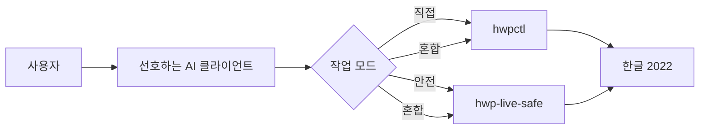

# HWP AI Bridge

한글 2022를 AI 코딩 도구와 함께 쓰기 위한 **사용자 선택형 허브**입니다.

이 저장소는 한글을 직접 제어하는 엔진을 복제하지 않습니다. 대신 사용자가 원하는
편집 방식과 AI 클라이언트를 골라 연결할 수 있게 안내·설정 예제·공개 준비 기준을
제공합니다.

> 아직 외부에 배포하지 않은 공개 준비 저장소입니다. 이 저장소만 설치해서는 한글을
> 편집하지 않으며, 아래 엔진 중 하나 이상이 필요합니다.

## 먼저 선택하세요

| 원하는 방식 | 설치할 엔진 | 적합한 경우 |
| --- | --- | --- |
| 직접 모드 | [`hwpctl`](https://github.com/Jasujung99/hwpctl) | 이미 열어 둔 한글 문서의 짧은 수정, 표 채우기, 서식 변경 |
| 안전 모드 | `hwp-live-safe` (출시 준비 중) | 새 초안, 개인정보 입력, 장문·불확실한 변경의 검토와 승인 |
| 혼합 모드 | 둘 다 | 계획은 검토하고, 확정된 짧은 변경은 열린 문서에 적용 |



`hwpctl`은 열린 문서를 직접 다루는 엔진이고, `hwp-live-safe`는 새로 연
자동화 소유 문서에서 미리보기·승인·로컬 프로필 보호를 우선하는 엔진입니다.
기능과 한계는 [작업 모드](docs/modes.md)에서 비교합니다.

## 빠른 시작

### 1. 엔진 설치

**직접 모드**는 현재 공개된 `hwpctl` 저장소에서 설치합니다.

```powershell
git clone https://github.com/Jasujung99/hwpctl.git
Set-Location hwpctl
py -m pip install -e ".[windows]"
hwpctl status
```

**안전 모드**는 `hwp-live-safe`가 첫 공개 릴리스를 낸 뒤 설치합니다.
릴리스 뒤의 권장 명령은 다음과 같습니다.

```powershell
uv tool install hwp-live-safe
hwp-live-safe
```

현재는 안전 모드의 공개 패키지와 저장소 URL을 의도적으로 확정하지 않았습니다.
그 전에는 [개발용 설치](docs/install.md#안전-모드-개발용-설치)만 사용하세요.

### 2. AI 클라이언트 설정

원하는 클라이언트와 모드에 맞는 예제를 복사한 뒤, 기존 MCP 설정의 항목과
**병합**합니다. 예제에는 개인 경로, 토큰, 프로필 값이 들어 있지 않습니다.

| 클라이언트 | 설정 예제 |
| --- | --- |
| Codex | [integrations/codex](integrations/codex) |
| Claude Code | [integrations/claude-code](integrations/claude-code) |
| Cursor | [integrations/cursor](integrations/cursor) |
| Grok Build / 로컬 CLI | [integrations/grok-build](integrations/grok-build) |

자세한 절차는 [클라이언트 연결](docs/client-setup.md)을 보세요.

## 현재 제공 범위

| 항목 | 상태 |
| --- | --- |
| 동일 PC의 Codex·Claude Code·Cursor·Grok Build에서 stdio MCP 사용 | 설정 예제 제공 |
| 열린 한글 문서 직접 편집 | `hwpctl`에서 제공, 실기 검증 확대 중 |
| 새 문서의 미리보기·승인·개인정보 로컬 삽입 | `hwp-live-safe`에서 제공, 공개 준비 중 |
| 두 엔진을 한 번의 명령으로 조정하는 공용 라우터 | 계획 단계 |
| 원격 웹 AI에서 로컬 한글 제어 | 기본 제공하지 않음 |

혼합 모드는 현재 “두 MCP 서버를 함께 등록해 작업마다 선택하는 방식”입니다.
문서 내용을 두 엔진 사이에서 자동 전달하거나 공용 잠금을 제공하는 라우터는 아직
구현되지 않았습니다. 현재 가능한 범위는 [혼합 모드의 의미](docs/modes.md#혼합-모드)를
확인하세요.

## 공개 순서

1. `hwpctl`을 직접 모드 엔진으로 정리하고 실제 한글 2022 환경에서 검증합니다.
2. `hwp-live-safe`를 안전 모드 엔진으로 별도 공개합니다.
3. 이 허브에서 사용자 선택·설치·클라이언트 예제를 제공합니다.
4. 충분한 실기 검증 뒤 공용 라우터와 선택형 Windows 설치기를 추가합니다.

각 단계의 공개 기준은 [릴리스 체크리스트](docs/release-checklist.md)에 있습니다.

## 지원 환경과 주의사항

- Windows와 한글 오피스 2022를 대상으로 합니다.
- 한글 문서는 중요한 원본이므로, 첫 사용은 반드시 복사본에서 검증하세요.
- 어떤 AI도 사용자의 승인 없이 원본을 덮어쓰거나 저장해서는 안 됩니다.
- 로컬 프로필·토큰·문서의 개인정보를 이 저장소에 커밋하지 마세요.

자세한 제한은 [호환성](docs/compatibility.md)과 [알려진 제한](docs/known-limitations.md)을
참조하세요.

## 기여와 보안

공개 이슈에는 실제 문서, 개인정보, API 토큰, 절대 경로를 올리지 마세요.
[기여 안내](CONTRIBUTING.md)와 [보안 정책](SECURITY.md)을 먼저 읽어 주세요.
