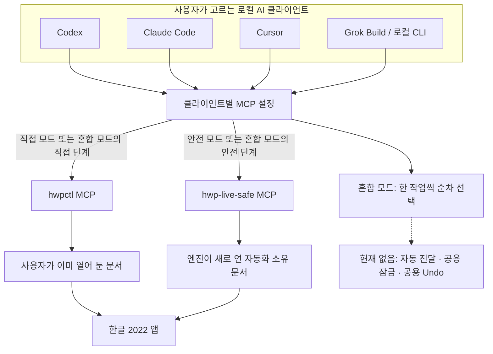
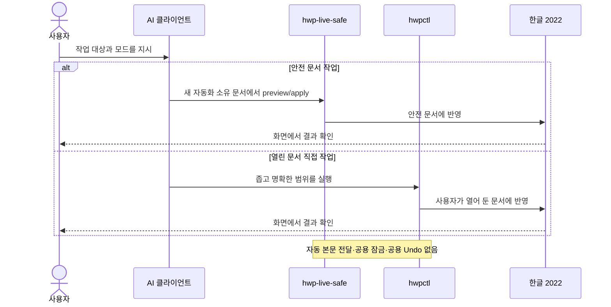
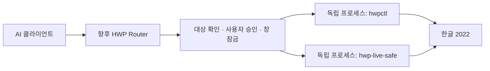

# 구조와 책임 분리

HWP AI Bridge는 한글 제어 엔진이 아니라, 사용자가 AI 클라이언트와 편집 엔진을
독립적으로 고를 수 있게 하는 문서·설정 허브입니다.

## 현재 구조

두 MCP를 함께 등록해도 두 엔진이 자동으로 연결되는 것은 아닙니다. AI 클라이언트는
사용자의 요청에 따라 한 번에 한 엔진을 호출하고, 두 엔진은 서로 다른 문서 소유 모델을
유지합니다. 한 엔진이 만든 변경 계획이나 본문을 다른 엔진으로 자동 전송하지 않습니다.

## 각 층의 책임

| 층 | 책임 | 책임 밖의 일 |
| --- | --- | --- |
| AI 클라이언트 | 자연어 대화, 대상·모드 확인, MCP 도구 호출 | 한글 COM 자동화 구현 |
| [`hwpctl`](https://github.com/Jasujung99/hwpctl) | 사용자가 열어 둔 문서의 읽기·선택 영역·표·서식·저장 제어 | 안전 엔진의 문서·승인 상태 공유 |
| [`hwp-live-safe`](https://github.com/Jasujung99/hwp-live-safe) | 새 자동화 소유 문서, 미리보기, 승인, 로컬 프로필, 변경 감지 | 임의의 기존 문서에 자동 연결 |
| HWP AI Bridge | 모드 안내, 설정 예제, 호환성·안전 기준 | 현재 시점의 런타임 라우팅·잠금·Undo 조정 |

## 현재 혼합 모드의 순서

“안전 엔진에서 승인하면 직접 엔진이 자동 적용한다”는 흐름은 현재 제공하지 않습니다.
사용자가 대화에서 승인한 뒤 AI 클라이언트가 직접 엔진을 별도로 호출하는 경우에도,
대상 문서와 선택 범위를 다시 확인해야 합니다.

## 후속 라우터 구조

로드맵 `0.3`에서는 독립 실행되는 두 엔진을 subprocess/stdio로 조정하는 공용 라우터를
검토합니다. MCP 1.x와 2.x 패키지를 한 Python 환경에서 import하지 않습니다.

이 다이어그램은 목표 구조이며 현재 구현 상태가 아닙니다. 구현 전까지는
[혼합 모드 운영 규칙](modes.md#혼합-모드)을 따릅니다.
