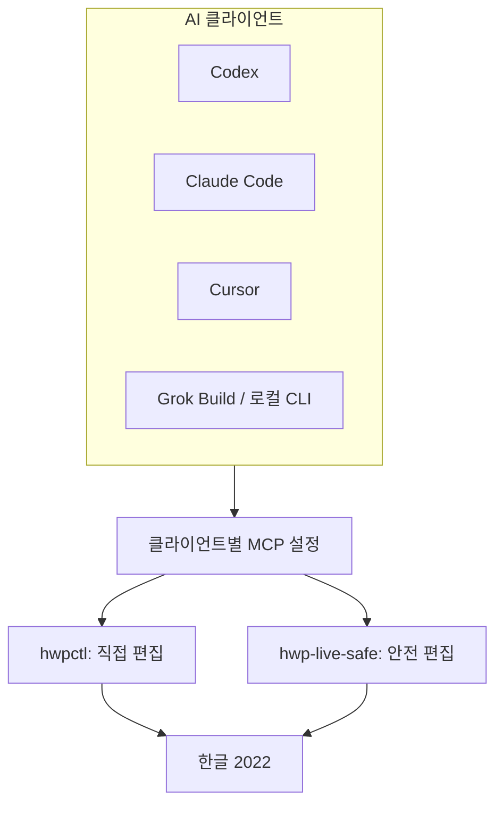
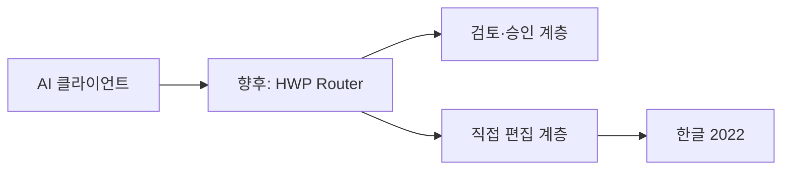

# 구조와 책임 분리

HWP AI Bridge는 한글을 제어하는 또 하나의 엔진이 아닙니다. 사용자가 사용하는 AI와
편집 엔진을 분리해 선택권을 유지하는 허브입니다.

## 각 층의 책임

| 층 | 책임 | 책임 밖의 일 |
| --- | --- | --- |
| AI 클라이언트 | 자연어 대화, 사용자 의도 확인, 도구 호출 | 한글 COM 자동화 구현 |
| `hwpctl` | 열린 문서의 읽기·선택 영역·표·서식·저장 제어 | 장문 변경의 의미 판단, 개인정보 관리 |
| `hwp-live-safe` | 새 문서, 미리보기, 승인, 로컬 프로필 삽입, 변경 감지 | 임의의 기존 문서에 자동 연결 |
| HWP AI Bridge | 모드 안내, 설정 예제, 안전 기준, 공개 준비 | 두 엔진의 동시 제어·문서 자동 전달 |

## 공용 라우터는 후속 단계입니다

장기적으로는 승인된 변경 계획만 `hwpctl`에 전달하고, 같은 한글 창에 대한 동시 접근을
조정하는 `hwp-router`를 둘 수 있습니다.

이 라우터는 아직 구현되지 않았습니다. 현재의 혼합 모드는 두 서버를 함께 등록한 뒤
사용자와 AI가 작업 단위로 선택하는 운영 방식입니다.
